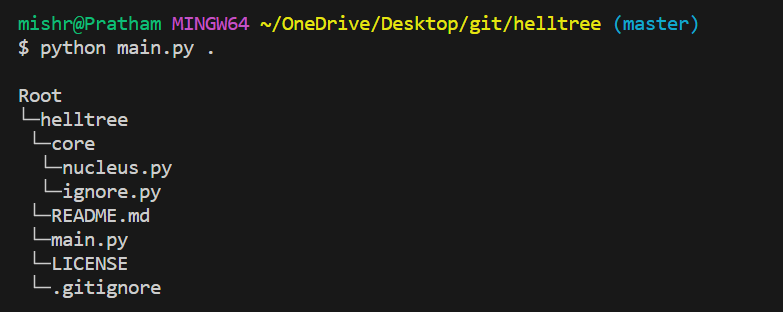
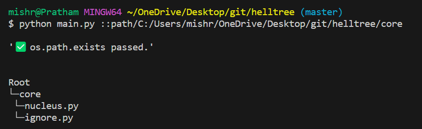

# Helltree 💀

Create tree structure of your workspace in just one click.

## Usage

1. Clone the repository.

```bash
git clone <repo-link>
```

2. Change directory.

```
cd helltree
```

3. Run main.py:

```bash
python main.py <action>
```

Here, `<action>` is defined as below:

```txt
Welcome to Helltree! 💀

Command: python main.py <action>

<Action>      <Abbreviation>        <Description>
--h           help                  Display this help message.
--cwd         current directory     Display the current working directory.
.             period                Generate a tree structure of the current directory.
--e           exit                  Exit the program.
::path/       path of the folder    Generate a personalized tree for the specified folder path.
                                    Example: python main.py ::path/to/folder
```

## Preview




### License - [MIT](LICENSE)
